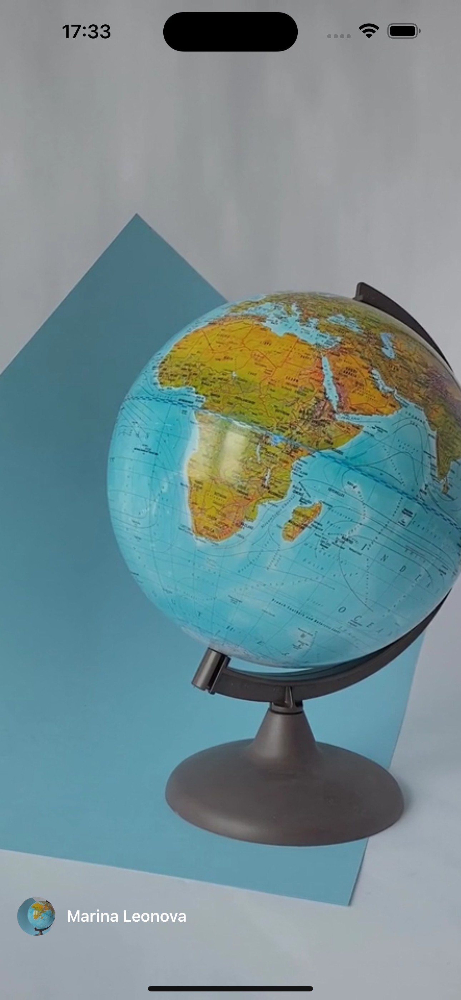
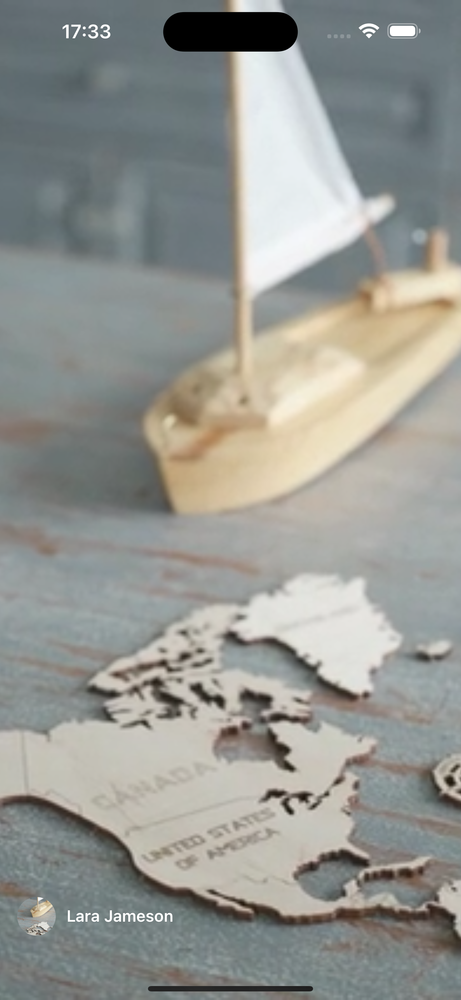

# 🎥 VideoView

Um aplicativo desenvolvido em **React Native** para **visualização de vídeos curtos** no formato vertical.  

O app faz uso da [API do Pexels](https://www.pexels.com/api/) para buscar e exibir os vídeos, com suporte a rolagem infinita, autoplay do vídeo atual e pausa automática dos demais.

---

## ✨ Funcionalidades

- 🔄 Feed de vídeos com rolagem infinita
- ▶️ Reproduz automaticamente o vídeo em destaque
- ⏸️ Pausa os vídeos fora da tela
- 📱 Suporte a iOS e Android
- 🌊 Vídeos exibidos a partir da API do Pexels

---

## 🛠️ Tecnologias utilizadas

- [React Native](https://reactnative.dev/)  
- [TypeScript](https://www.typescriptlang.org/)  
- [React Native Video](https://github.com/react-native-video/react-native-video)  
- [Axios](https://axios-http.com/)  
- [Dotenv](https://github.com/goatandsheep/react-native-dotenv)  

---

## 📂 Estrutura de pastas

```bash
video-view
│── android/              # Projeto Android
│── ios/                  # Projeto iOS
│── src/                  # Código principal
│   ├── @types/           # Tipagens
│   ├── assets/           # Imagens
│   ├── screens/          # Telas do app
│   └── services/         # Configuração de APIs
│── .env                  # Variáveis de ambiente
│── package.json          # Dependências e scripts
│── App.tsx               # Entrada principal
```

## ⚙️ Como rodar o projeto

Clone este repositório:
```bash
git clone https://github.com/seu-usuario/video-view.git
cd video-view
````

Instale as dependências:

```bash
npm install 

ou

yarn install
````


Configure o arquivo .env:
```bash
PEXELS_API_KEY=YOUR_PEXELS_API_KEY
```

Rode no emulador ou dispositivo físico:

```bash
yarn android   # para Android
yarn ios       # para iOS
```

## 📱 Screenshots
Feed de Vídeos	Exemplo de Usuário

<table>
  <tr>
    <td></td>
    <td></td>
  </tr>
</table>

## 🎬 Vídeo Demo


---

Feito com 💜 por Yasmin Santana Santos